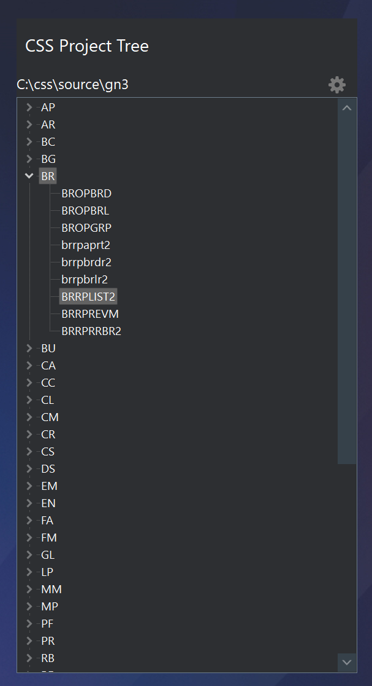

## ProjectTree - a Welcome Page Plug-in

The company I work for has hundreds of small Delphi projects with overlapping functionality dating back over three decades and originally written in COBOL. The file naming structure they developed dictates that the first two characters of the project name determine the "application module" to which it belongs. All these projects are in the same source folder. So, a useful the IDE plug-in would be a TreeView listing all the projects in a source folder grouped by the first two characters of the project name.

With this goal in mind, I copied the "CaptionFrameDemoPlugin" from Delphi's Samples to a new folder and modified it to show all projects from a configured source folder in a TreeView.

The plug-in provides a simple frame to house the TreeView and implements the standard caption frame created by the `WelcomePagePluginService`. Just above the TreeView is a small panel containing a label and a button. The label displays the currently configured source folder and the button allows the user to change it. The TreeView is filled upon the construction or after the folder is selected.

### Configuration and Project Loading

The configured source folder is stored in the Windows registry using `WelcomePageSettings.SaveSetting`.  

A project is loaded using the following code:

```
  if Supports(BorlandIDEServices, IOTAActionServices, ModuleServices) then begin
    (BorlandIDEServices as IOTAActionServices)
        .OpenProject(TPath.Combine(ProjPath, tvProjectTree.Selected.Text + '.dpr'), True);
  end;
```

### Speed

Since there are hundreds of projects in use where this plug-in is installed, there's a little delay whenever the plug-in is re-installed or when Delphi starts up and is initializing the Welcome Page plug-ins. The projects are all stored on a fast local SSD so loading time is minimal but it would be a good idea to make this multi-threaded for smoother operation.

